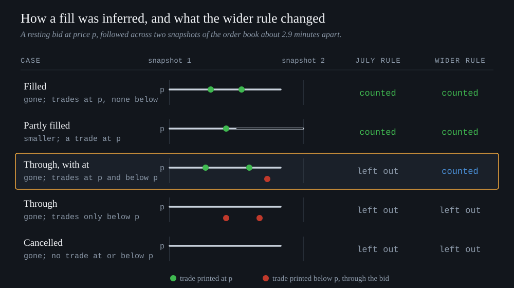
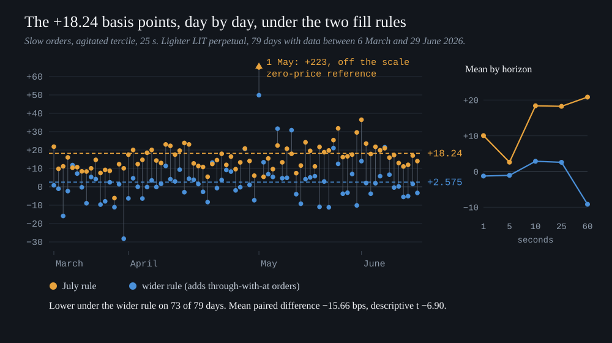
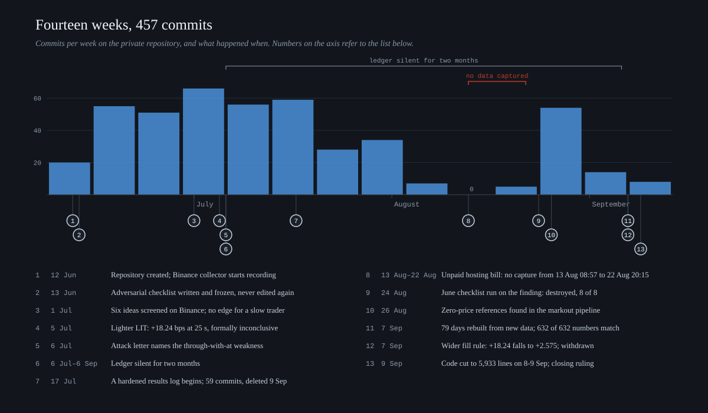
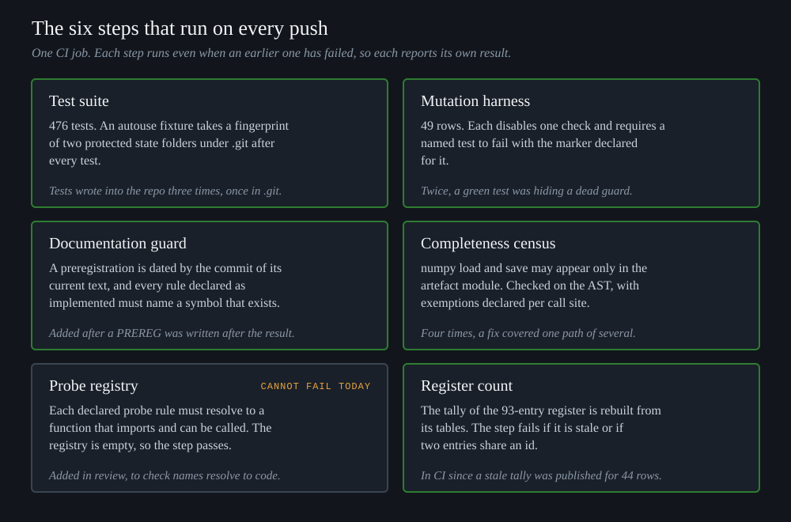
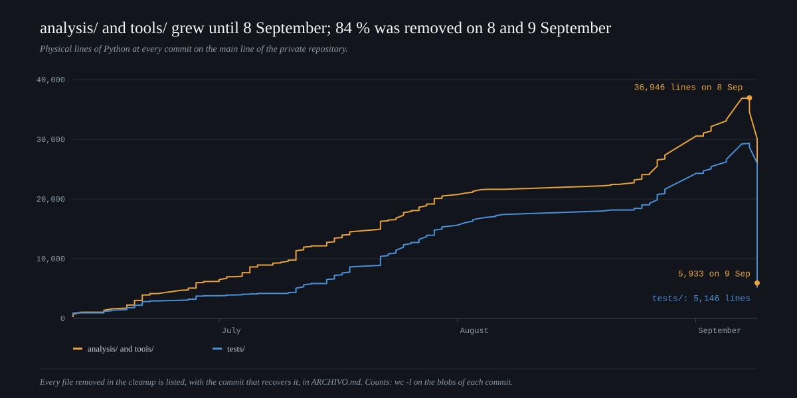

<p align="center">
  
</p>

<p align="center">
  <a href="https://github.com/Lostmanu/quant-system/actions/workflows/ci.yml"></a>
  
  
  
</p>

I looked for a trading edge in crypto perpetual futures between June and September 2026 and did not
find one. The programme's headline estimate, +18.24 basis points per filled order on the Lighter LIT
perpetual, was invalidated as a confirmatory result on 26 August 2026 and withdrawn as evidence of an
edge on 7 September, after a post hoc re-analysis also counted the orders that vanished while trades
printed both at and through their price, which brought it down to +2.575. The programme ran to 457
commits, and the withdrawal needed a rebuild of 79 days of order-book data from re-acquired files, which
matched the original run on all 632 recorded numbers.

This repository is the laboratory as it stood when it closed: the code that survived the final
cleanup, 476 tests, six checks that run on every push, and the written record of what was tried and
decided, mostly in Spanish. It contains no market data, so the result cannot be re-run from here; the
tests and the checks can. Most of the code was written and audited by AI agents under a protocol I set
up, and [How it was built](#how-it-was-built) says who did what. The companion repository
[ninety-three-wrong-claims](https://github.com/Lostmanu/ninety-three-wrong-claims) holds a paper on the
register of false claims the programme kept.

## The question

Can a small participant with no speed advantage earn a lasting edge in crypto perpetual futures?

In the first chapter the programme recorded eight thinly traded Binance perpetuals with its own
collector (median feed latency about 113 ms in a one-day check) and screened six ideas on those
recordings and on downloaded history. None gave a usable edge. The only one tested on held-out data,
fading extreme order-flow imbalance, lost 10.71 bps per event after costs; the others lacked signal or
events, or needed a speed that a slow trader does not have. The conclusion went into the ledger on 1 July
2026 ([`LEDGER.md`](docs/LEDGER.md?plain=1#L23)). A one-day screen of Hyperliquid then failed its first
layer, with 6 candidate symbols against a floor of 30 fixed in advance.

In the second chapter the programme moved to Lighter, a decentralised exchange that at the time charged
standard accounts no trading fees, and narrowed the question. When a patient trader's limit order rests in the book and
gets filled, does the market then move in that trader's favour or against it?

## How a fill was inferred

<p align="center">
  
</p>

The programme never placed an order. It followed other participants' orders through a commercial
archive of Lighter's order book at the level of individual orders, sampled about every 2.9 minutes, and
matched them with the trades printed in between. The third row of the diagram, called through-with-at
below, is an order that disappeared while trades printed both at its price and through it. The July code
set those orders aside, and the September re-analysis counted them.

## What happened to the positive result

<p align="center">
  
</p>

On 5 July 2026 the preregistered confirmation test gave +18.24 bps at 25 seconds for slow orders in the
most volatile third of the sample (t +6.69, 79 days). The same test required the 5-second horizon to
agree, and it did not (+2.61, t +0.29), so its formal verdict was inconclusive
([`LEDGER.md`](docs/LEDGER.md?plain=1#L1681)). The estimate was withdrawn in three steps.

1. On 24 August an adversarial checklist, frozen on 13 June when the finding did not yet exist, was run
   against it for the first time, by AI agents working one threat each. It returned DESTROYED, with all 8
   of its threats applying
   ([report](docs/AUDITORIA_QUANT_REVIEWER_2026-08-24.md), [checklist](.claude/agents/quant-reviewer.md)).
2. On 26 August the markout pipeline was found to accept reference prices of zero. Dropping the one
   affected fill in the headline cell moved it from +18.24 to +15.60 and its effective n from 79 to 14.7,
   and the incident report invalidated the +18.24 as a confirmatory result without putting another figure
   in its place ([incident](docs/INCIDENTE_2026-08-26_REF_INVALIDA.md)).
3. On 7 September the 79 days were rebuilt, the July number came back exactly, and the re-analysis
   counted the through-with-at orders. Among slow-order events with a trade at or through the order's
   price, the share admitted as fills went from 10.1 % to 86.8 %, and the 25-second mean fell to +2.575.

| horizon and reference | July rule (bps) | wider rule (bps) | paired difference (bps) | descriptive t |
|---|---:|---:|---:|---:|
| 5 s, July reference | +2.6101 | −1.0843 | −3.6944 | −0.5505 |
| 5 s, validated reference | +10.3795 | −0.0976 | −10.4772 | −13.4025 |
| **25 s, July reference** | **+18.2368** | **+2.5750** | **−15.6618** | **−6.9043** |
| 25 s, validated reference | +15.6036 | +1.4988 | −14.1048 | −9.8270 |

The validated reference drops events whose reference or fill price is not a finite positive number, or
whose markout reaches 9,000 bps in absolute value, which is the correction for the 26 August defect.

The [ruling](docs/DICTAMEN_MESA_2026-09-07_I5_D1_79.md) withdrew the +18.24 as evidence of a tradable
edge, kept the +2.575 on the record without calling it profit, and left in place the standing halt on
production and trading. The re-analysis had fixed 5 seconds as its primary horizon, and there the paired
difference has t −0.55, so the withdrawal rests on the 25-second rows. It was also decided after the
result was known. The reference price was the nearest Binance trade, where the preregistration had asked
for the mid price. And fast orders scored +11.78 bps under the July rule as well, so the effect was never
specific to slow orders.

## Timeline

<p align="center">
  
</p>

The ledger has no entry between 6 July and 6 September, a stretch of 248 commits. Fifty-nine of them
went into a hardened log for recording results, which was deleted in September.
From 13 to 22 August nothing was captured, because a hosting bill had not been paid.

## The checks

<p align="center">
  
</p>

```bash
git clone https://github.com/Lostmanu/quant-system
cd quant-system/quant-system-ingesta/qs
pip install -r requirements-test.txt -c requirements-lock.txt

python -m pytest tests/ -q                    # 476 passed
python tools/mutacion_ref_valida.py           # 49/49 rows bite
python tools/guardia_documental.py            # preregistration dates, spec against code
python tools/guardia_completitud.py           # numpy I/O only where it is wrapped
python tools/registro_sonda.py                # probe registry (empty)
python tools/recuento_auditoria.py --check    # register count is current
```

Each of the harness's 49 rows disables a guarded check, in the guard tools themselves or in
`analysis/` and `ingestion/`, and passes only if a named test fails with the marker declared for it. A red test is not enough, because a test can fail for an
unrelated reason. On its first run the harness found two defects in the shared code it was built on:
the regular expression that parsed pytest failures missed parametrised test ids, and the function that
judged the results counted them as collateral failures
([`ci.yml`](.github/workflows/ci.yml?plain=1#L34)).

One of the six steps cannot fail at present: the probe registry is empty, and an empty registry passes.
Half of the documentation guard is in a similar position. Its chronology check exempts six of the seven
preregistrations as older than its rule, and the seventh declares two artefacts that do not exist yet,
so there is nothing to date. Its other half checks that four rules declared as implemented still name a
function or constant in `ref_valida.py`.

## The code, and what was removed

<p align="center">
  
</p>

The cleanup of 8 and 9 September retired the modules that only closed studies used. `analysis/` and
`tools/` went from 36,946 to 5,933 lines, and the CI suite from 2,023 tests to 476
([closing ruling](docs/DICTAMEN_MESA_2026-09-09_V2_CIERRE.md)). Each removed file is listed in
[`ARCHIVO.md`](ARCHIVO.md) with the commit that recovers it. What is left in `analysis/` is the
reference validator with its artefact and lane layers, which the mutation harness guards; a set of
tested libraries (purged and embargoed cross-validation, PSR, DSR and PBO, multiple-testing haircuts,
bars, toxicity, regimes, cross-section, venue adapters), most of which no code outside the tests calls
any more; and four download scripts without tests.

## Reading the record

The record is in Spanish. [`docs/README.md`](docs/README.md) maps every document in English and has a
glossary of the terms that appear in file names. A reader with an hour could take them in this order:

1. [`RESEARCH_BRIEF.md`](docs/RESEARCH_BRIEF.md), in English: what the programme set out to do.
2. [`testigos/ARCO.md`](docs/testigos/ARCO.md): the story of June and July, chapter by chapter, with commits.
3. [`PREREG_CONFIRMACION_LIT.md`](docs/PREREG_CONFIRMACION_LIT.md): the test that produced the +18.24.
4. [`AUDITORIA_QUANT_REVIEWER_2026-08-24.md`](docs/AUDITORIA_QUANT_REVIEWER_2026-08-24.md): the checklist review.
5. [`DICTAMEN_MESA_2026-09-07_I5_D1_79.md`](docs/DICTAMEN_MESA_2026-09-07_I5_D1_79.md): the re-analysis and the ruling.
6. [`AUDITORIA_DEL_METODO.md`](docs/AUDITORIA_DEL_METODO.md): the register of 93 false claims.

## About this copy

This is a snapshot without history of the original repository at commit `93f3e35`, which stays
private. It has 173 of that repository's 344 files; [`EXCLUIDO.md`](EXCLUIDO.md) lists the other 171
by category, and [`MANIFEST.md`](MANIFEST.md) gives the SHA-256 of every file as exported. Server
addresses, account names, key locations and local paths were replaced by markers such as `<VPS_IP>` and
`<USER_HOME>` in 35 files, following a sanitisation act written on 5 July 2026
([`SANEAMIENTO.md`](docs/testigos/SANEAMIENTO.md)). One link, to a custody folder on my machine, points
outside the repository on purpose.

One of the 173 copied files has changed since the snapshot: two collector tests read the real disk and
failed on any machine whose temporary folder was more than 85 % full, so a fixture now reports the disk
to them as half full. Hashes and seals quoted inside the record refer to the private originals, so the
35 files with markers will not match them byte for byte.

Three of the charts (result, timeline and code) are drawn from CSV files by
[`assets/figures/make_figures.py`](assets/figures/make_figures.py), and a second workflow fails if a
published chart no longer matches its data. [`assets/figures/data/README.md`](assets/figures/data/README.md)
says where each number comes from. The banner and the two diagrams are drawn by hand.

## How it was built

I chose the questions, paid for the data and signed the decisions. The code was written by AI agents.
Most commits carry the signature of Claude Code (Anthropic), 383 of 457. Codex (OpenAI) appears in the
record from late July, and by September it implemented while Claude Code audited and ran the long jobs.
A review role, called *la mesa* in the documents, issued the rulings. Another AI model filled it, Codex
in the September documents, and I signed the result, so the rulings are not independent reviews. The
agents account for part of the register of 93 false claims; the record does not attribute its entries to
a named person or system, and it records who or what caught each one.

## Limits

1. No edge was found, and nothing here supports a strategy. The repository documents how the search was
   run.
2. The trading result cannot be reproduced from this repository, which contains no market data.
3. The re-analysis that withdrew the estimate was post hoc, and the reference price in every branch of it
   departs from the preregistration.
4. There is one laboratory and one author, no second implementation and no control group.
5. No one outside the programme has reviewed the rulings.

## Licence

Code under [Apache 2.0](LICENSE), documents under [CC BY 4.0](https://creativecommons.org/licenses/by/4.0/).
To cite it, use [`CITATION.cff`](CITATION.cff).

Manuel Beardo Campo ·
[LinkedIn](https://www.linkedin.com/in/manuel-beardo-campo-804a9b201/) ·
[the paper](https://github.com/Lostmanu/ninety-three-wrong-claims)
