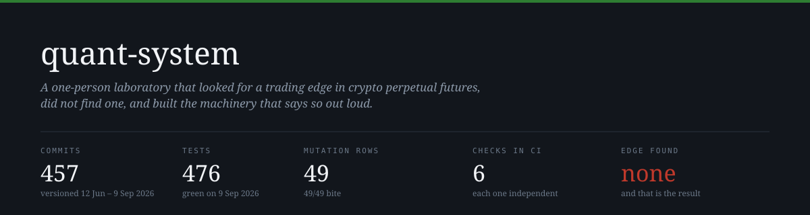
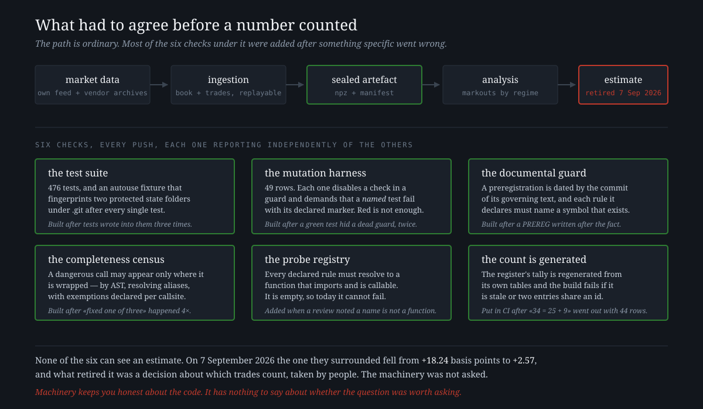

<p align="center">
  
</p>

<p align="center">
  <a href="https://github.com/Lostmanu/quant-system/actions/workflows/ci.yml"></a>
  
  
  
</p>

---

This is the laboratory itself: the code, the guards, the preregistrations, the rulings and the running
record of a search for systematic edge in crypto perpetual futures, versioned from June to September 2026
and run by one person with AI assistants.

**It did not find an edge.** The one positive estimate it produced was retired by its own authors on
7 September 2026. The interesting part is not the result — it is what had to be true before anyone was
allowed to believe a number, and the fact that none of it was enough.

> The companion repository [**ninety-three-wrong-claims**](https://github.com/Lostmanu/ninety-three-wrong-claims)
> holds the paper that analyses the register of every claim this programme got wrong. This repository
> holds the machine that produced them.

---

## The result, stated plainly

The programme's one positive estimate was a markout of about **+18.24 basis points** at a 25-second
horizon, on the slow cohort, in agitated regime, over 79 days of one venue. Its preregistered test came out
**inconclusive**: the 5-second horizon did not agree ([`LEDGER.md`](docs/LEDGER.md?plain=1#L1681)). An
adversarial checklist [frozen on 13 June](.claude/agents/quant-reviewer.md), three weeks before the finding
existed, was run against it for the first time on 24 August and returned
[**DESTROYED**, 8 of 8 threats applying](docs/AUDITORIA_QUANT_REVIEWER_2026-08-24.md). On 7 September 2026
it was re-measured with one admission rule widened: resting orders that the market both printed *at* and traded *through* in the same interval,
which the historical recipe had left out. Same 79 days, paired deltas:

| horizon and reference | historical admission | with through-and-at | paired delta | descriptive t |
|---|---:|---:|---:|---:|
| 5 s, historical recipe | +2.6101 | −1.0843 | −3.6944 | −0.5505 |
| 5 s, validated reference | +10.3795 | −0.0976 | −10.4772 | −13.4025 |
| **25 s, historical recipe** | **+18.2368** | **+2.5750** | **−15.6618** | **−6.9043** |
| 25 s, validated reference | +15.6036 | +1.4988 | −14.1048 | −9.8270 |

At 25 seconds, the admission rule alone removes **85.88 %** of the mean. The delta is negative on 73 of
79 days. The programme's own [attack letter](docs/testigos/CARTA_DE_ATAQUE.md), written two months
earlier, had named this exact sensitivity, ordered it tested, and argued it would shrink the mean without
flipping it. At 5 seconds, the primary horizon, the mean changed sign, though not by a margin that proves
anything (t = −0.55). The ruling — [`docs/DICTAMEN_MESA_2026-09-07_I5_D1_79.md`](docs/DICTAMEN_MESA_2026-09-07_I5_D1_79.md)
— withdrew the +18.24 as support for an operable edge, kept the +2.57 residue on the record with its
limits, and left the production stop in force. Nothing has been ratified since.

---

## Run the six checks that CI runs

Once it is cloned and the test dependencies are installed, nothing here needs market data, a key or a
network.

```bash
git clone https://github.com/Lostmanu/quant-system
cd quant-system/quant-system-ingesta/qs
pip install -r requirements-test.txt -c requirements-lock.txt

python -m pytest tests/ -q              # 476 passed (see the note below)
python tools/mutacion_ref_valida.py     # 49/49 rows bite
python tools/guardia_documental.py      # preregistration chronology + spec vs code
python tools/guardia_completitud.py     # no unguarded callsite
python tools/registro_sonda.py          # the probe registry: empty, so it passes
python tools/recuento_auditoria.py --check   # the register's count is not stale
```

<p align="center">
  
</p>

One known defect: two collector tests read the real disk, so on a machine whose temporary folder is more
than 85 % full they exit with code 3 and the suite reports 474 passed and 2 failed. The collector is doing
what it should; the tests should not depend on the disk. It is left as it was at the snapshot, and said here.

The mutation harness is the one worth reading. A test that passes proves nothing about the guard it
claims to defend, so each of its 49 rows disables one check in production code and requires a
**named** test to fail **with the declared marker**. It distinguishes a real catch from a wrong failure,
a timeout and — the case it exists for — a green test that was never testing anything. Its first run
found two defects in the shared machinery it was built on:
[`tools/mutacion_ref_valida.py`](quant-system-ingesta/qs/tools/mutacion_ref_valida.py).

---

## What is here

| path | what it is |
|---|---|
| [`quant-system-ingesta/qs/analysis/`](quant-system-ingesta/qs/analysis) | the libraries that survived the V2 simplification, each with its tests: purged and embargoed cross-validation, PSR/DSR/PBO and multiple-testing haircuts, bars, toxicity, regimes, cross-section, venue adapters. The pipelines that ran the study were retired and are listed, with the commit that recovers them, in [`ARCHIVO.md`](ARCHIVO.md) |
| [`quant-system-ingesta/qs/tools/`](quant-system-ingesta/qs/tools) | the guards, the mutation harness, the pre-flight, the counter |
| [`quant-system-ingesta/qs/tests/`](quant-system-ingesta/qs/tests) | 476 tests, plus an autouse fixture that fingerprints two protected state folders under `.git` after every test |
| [`quant-system-ingesta/qs/ingestion/`](quant-system-ingesta/qs/ingestion) | the collector: order book and trades, written to be replayable |
| [`docs/`](docs) | the file: ledger, preregistrations, specifications, incidents, rulings and audits, in date order |
| [`docs/AUDITORIA_DEL_METODO.md`](docs/AUDITORIA_DEL_METODO.md) | the register of 93 claims this programme made and got wrong, with who caught each one |
| [`docs/testigos/`](docs/testigos) | the witness acts, including the sanitisation act this mirror was built under |
| [`MANIFEST.md`](MANIFEST.md) · [`EXCLUIDO.md`](EXCLUIDO.md) | the SHA-256 of every file here, and what was left out of the original tree, with reasons |

The record is in Spanish, because that is the language it was written in. Rewriting it in English after
the fact would make it a different document. [`docs/RESEARCH_BRIEF.md`](docs/RESEARCH_BRIEF.md) is in
English and is the shortest way in.

---

## What this mirror is, and what it is not

This is a **snapshot without history**. The original tree has 457 commits across 344 files; this has
173 of those files at commit `93f3e35`, sanitised under an act written on 5 July 2026 and kept since:
[`docs/testigos/SANEAMIENTO.md`](docs/testigos/SANEAMIENTO.md). Every file's SHA-256 is in
[`MANIFEST.md`](MANIFEST.md), so the original tree can be checked against this one, in that direction.

Four consequences, and none of them is decoration:

<table>
<tr><td valign="top"><b>1</b></td><td><b>Two of the six checks cannot fail today, here or in the original tree.</b> The probe registry is empty, and an empty registry returns success by design. The documental guard's chronology section has exactly one preregistration it is not told to exempt, and the two artefacts that one declares do not exist yet, so there is nothing to date. Both are green without having checked anything, which is the case the mutation harness exists to catch, and a badge should not be shown without saying so. Here there is a third reason: with no history, the guard could not date anything even if there were something to date.</td></tr>
<tr><td valign="top"><b>2</b></td><td><b>The trading result is not reproducible from here.</b> The market data is not included, out of licence prudence. The code, the guards, the tests and the whole file are.</td></tr>
<tr><td valign="top"><b>3</b></td><td><b>Identifiers were replaced</b>, not removed: <code>&lt;VPS_IP&gt;</code>, <code>&lt;VPS_HOST&gt;</code>, <code>&lt;STORAGEBOX_USER&gt;</code>, <code>&lt;STORAGEBOX_HOST&gt;</code>, <code>&lt;SSH_KEY&gt;</code>, <code>&lt;USER_HOME&gt;</code>, <code>&lt;KEY_DIR&gt;</code>, <code>&lt;KEY_FILE&gt;</code>, <code>&lt;VENDOR_BUCKET&gt;</code>, <code>&lt;USER&gt;@&lt;HOST&gt;:&lt;REMOTE_PATH&gt;</code>, and the hosting and backup providers by their roles. 35 of the 173 files carry at least one. The record still describes how the server was operated, because that is part of the record; what was removed is what would let someone find it. The act's sweep on 5 July found no credentials in the history up to that day, and the builder of this mirror swept its 173 files again for credential patterns and found none.</td></tr>
<tr><td valign="top"><b>4</b></td><td><b>The register is byte for byte the one in the companion repository</b>, where six rows were reworded before publishing: the two data vendors, two service names and the alert channel. There is one public version of it, and this is that one. The same names do appear elsewhere in this record, and one adapter module is named after one of the vendors, so the rewording keeps the register consistent across the two repositories; it does not hide them.</td></tr>
</table>

Every relative link in these documents resolves inside the repository except one, which points on purpose
to a custody folder on the author's machine as `<USER_HOME>/…`: it says where that evidence is held, and
that it is not here.

---

## Limits

<table>
<tr><td valign="top"><b>1</b></td><td><b>No edge was found</b>, and this repository is not evidence that one exists. It is evidence about how the search was conducted.</td></tr>
<tr><td valign="top"><b>2</b></td><td><b>The guards constrain the code, not the science.</b> None of them can see an estimate. What retired the positive one was a checklist frozen in June that nobody ran until August, an attack letter that had named the weakness in July, a re-analysis somebody had to order, and a decision about which trades count.</td></tr>
<tr><td valign="top"><b>3</b></td><td><b>One laboratory, one author.</b> There is no control group and no second implementation, so nothing here shows that this method finds more defects than another.</td></tr>
<tr><td valign="top"><b>4</b></td><td><b>Most of this was written by AI systems</b> — implementing, auditing and reviewing each other under a three-party protocol — and most of the entries in the register are their mistakes. That is stated in the paper and it is not a footnote.</td></tr>
<tr><td valign="top"><b>5</b></td><td><b>Nothing here is peer reviewed or ratified.</b> The rulings are internal decisions of the programme, and they say so.</td></tr>
</table>

---

<p align="center">
  <sub>
    Code under <a href="LICENSE">Apache 2.0</a> ·
    Documents under <a href="https://creativecommons.org/licenses/by/4.0/">CC BY 4.0</a><br>
    <b>Manuel Beardo Campo</b>, independent researcher ·
    <a href="https://github.com/Lostmanu/ninety-three-wrong-claims">the paper</a> ·
    <a href="https://www.linkedin.com/in/manuel-beardo-campo-804a9b201/">LinkedIn</a>
  </sub>
</p>
